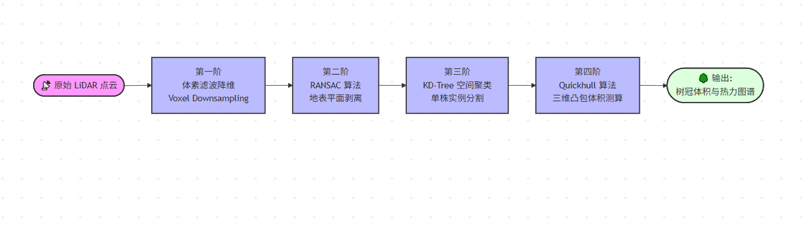
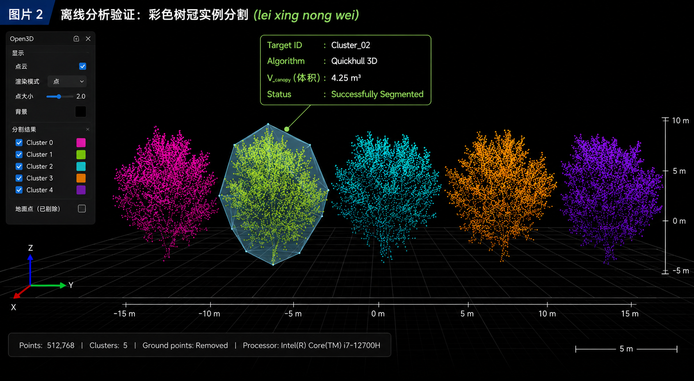

# 🚜 LeiXing Agri-Nav (雷行农卫 AGV)
**A Blind-Spot-Free Agricultural Inspection Platform Based on Pure Point-Cloud Odometry**
**基于纯点云解算的无盲区农业巡检平台**

> 💡 **Project Vision | 项目愿景** > 
> **[EN]** Created for the **2026 China-US Young Maker Competition**. Traditional agricultural robots suffer from GNSS signal loss and visual blindness in dense orchards and greenhouses. To solve this, we propose a highly robust, all-weather navigation architecture based on minimalist pure-LiDAR perception. We have built a complete 3D data processing pipeline, transforming a navigation chassis into an agricultural ecological data hub.
> 
> **[CN]** 本项目为 **2026中美青年创客大赛** 参赛项目。针对传统农业机器人在密林大棚中面临的“卫星信号丢失”与“视觉高动态致盲”痛点，我们提出了一种基于极简纯雷达感知的全天候高鲁棒性导航架构，并构建了从导航底盘到农业生态数据中枢的完整三维数据处理管线。

---

## 🌟 Core Features | 核心特性

* **🚫 Minimalist Perception | 极致的“减法”感知：** Discarding light-sensitive cameras and easily-obstructed RTK/GPS. Relying solely on a single Livox Mid-360s solid-state LiDAR to achieve all-weather, blind-spot-free mapping and navigation.
  完全摒弃对光照敏感的摄像头和易被遮挡的RTK/GPS，仅依托单颗 Livox Mid-360s 固态激光雷达，实现全天候、无盲区建图与导航。

* **🛡️ High-Robustness Anti-Vibration | 高鲁棒抗震算法：** Deeply deployed FAST-LIO2 tightly-coupled LiDAR-inertial odometry. Utilizing 200Hz high-frequency IMU prior data to absorb non-linear excitation caused by severe bumps, completely eliminating odometry divergence.
  深度部署 FAST-LIO2 紧耦合激光惯性状态估计，利用200Hz高频IMU先验数据吸收剧烈颠簸带来的非线性激振，彻底消除里程计发散。

* **🌳 3D Ecological Data Pipeline | 三维生态数据管线：** Innovatively turning massive mapping point clouds into valuable assets. Through a self-developed automated pipeline (**Voxel Downsampling ➔ RANSAC Ground Removal ➔ Clustering ➔ Quickhull**), it accurately outputs the volume data of irregular tree canopies.
  创新性地将建图产生的海量点云“变废为宝”，通过自研的自动化管线（体素降维 ➔ RANSAC去地 ➔ 聚类分割 ➔ Quickhull凸包计算），精准输出非规则树冠的体积数据。

* **🎯 Empowering Variable Rate Spraying (VRS) | 赋能变量喷洒：** Generating an "Orchard Leaf Area Density Heatmap" during inspection to guide drones in closed-loop "on-demand spraying" operations, reducing chemical pesticide abuse from the source and practicing low-carbon agriculture.
  巡检的同时生成“果园叶面积密度热力图”，指导无人机执行“按需施药”的闭环作业，从源头减少化学农药滥用，践行低碳农业。

---

## ⚙️ Hardware & System Architecture | 硬件与系统架构

* **Chassis System (底盘系统)：** AgileX Bunker Pro 2.0 Industrial Tracked Platform
* **Computing Node (计算节点)：** Mobile Computing Platform deploying VMware (Ubuntu 20.04 LTS)
* **Core Sensor (核心传感器)：** Livox Mid-360s (Built-in 6-axis IMU)
* **HMI (人机交互)：** Multi-threaded asynchronous rendering monitor terminal based on Python/PyQt5

---

## 📊 Offline Analysis Validation | 离线分析验证成果

*(Note: Upload your pipeline flowcharts and canopy analysis images to the repository and link them here)*

---

## 🤝 Open Source & Co-creation | 开源与共创计划

**[EN]** We deeply understand the high technical barriers and trial-and-error costs of developing agricultural robots in unstructured environments. We are sharing our system-level distributed architecture design, hardware selection logic, and FAST-LIO2 adaptation ideas as the first batch of open-source documents. We aim to lower the R&D barriers in the field of intelligent agricultural equipment and share our results with young makers globally to jointly prosper the agricultural robotics open-source ecosystem.

**[CN]** 团队深知非结构化环境下的农业机器人底层开发存在较高的技术门槛与极大的试错成本。目前，团队已将项目的系统级分布式架构设计、核心硬件选型逻辑及 FAST-LIO2 算法适配思路作为首批开源文档展示于此。我们期望以此降低农业智能装备领域的研发壁垒，与全球青年创客共享研发成果，共同繁荣农业机器人开源生态。

---

## 📅 Release Roadmap | 开源路线图

**[EN]** Following the principle of robust open source, the core code is currently in closed testing and academic preparation. We will gradually open it up in three phases:
**[CN]** 本项目秉承稳健开源的原则，核心代码正处于封闭测试与学术整理阶段。我们将按以下三个阶段逐步开放：

- [x] **Phase 1 (Current | 当前阶段):** Open system top-level architecture, hardware BOM list, and basic environment configuration guide. 
  开放系统顶层架构、硬件 BOM 清单与基础环境配置指南。
- [ ] **Phase 2:** Open source chassis CAN bus underlying communication adapter (Chassis Driver) and PyQt5-based HMI skeleton. 
  开源底盘 CAN 总线底层通信适配器与基于 PyQt5 的人机交互面板骨架。
- [ ] **Phase 3:** Open source the complete Python pipeline for 3D point cloud voxel downsampling, ground filtering, and Quickhull-based canopy volume measurement. 
  开源三维点云体素降维、去地滤波及基于 Quickhull 的树冠体积测算算法 Python 完整管线。
